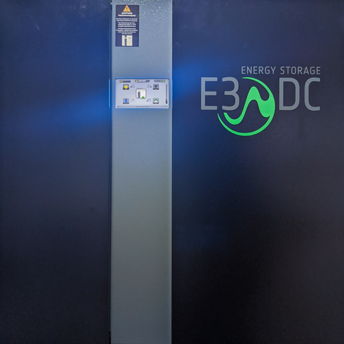

# ioBroker.e3dc-rscp

## Developer manual
This adapter is based on @iobroker/create-adapter v1.31.0
It was developed looking at E3/DC's [sample application](http://s10.e3dc.com/dokumentation/RscpExample.zip) which is written in C++.

The sample application package also contains the official tag lists, which are necessary to interpret RSCP frames semantically.

### Timestamp Handling

* RSCP: 8 byte BigInt [seconds], 4 byte Int [nanoseconds]
* internal processing is done via Float [seconds] and Date
* ioBroker object tree: human readable String like "2022-01-30 12:00:00.000"

### DB Namespace Semantics

In the DB namespace, time series can be requested from E3/DC:
* TIME_START = start of observed time range
* TIME_SPAN = length of observed time range; minimum is 900 seconds, i.e. 15 minutes
* TIME_INTERVAL = sampling rate; minimum is 900 seconds, i.e. 15 minutes

Results contain GRAPH_INDEX, described as "relative position within the graph". The data point's timestamp can be approximated like

	TIMESTAMP = TIME_START + GRAPH_INDEX * TIME_INTERVAL

Here is some data from test calls:
<table>
  <tr> <th>SPAN</th> <th>INTERVAL</th> <th>GRAPH_INDEX increment</th> <th># of values</th> </tr>
  <tr> <td>7200</td> <td>60</td> <td>13.6</td> <td>8</td> </tr>
  <tr> <td>3600</td> <td>60</td> <td>13.6</td> <td>4</td> </tr>
  <tr> <td>3600</td> <td>120</td> <td>6.8</td> <td>4</td> </tr>
  <tr> <td>120</td> <td>3600</td> <td>ERR</td> <td>ERR</td> </tr>
  <tr> <td>120</td> <td>120</td> <td>ERR</td> <td>ERR</td> </tr>
  <tr> <td>360</td> <td>120</td> <td>ERR</td> <td>ERR</td> </tr>
  <tr> <td>1800</td> <td>120</td> <td>6.8</td> <td>2</td> </tr>
  <tr> <td>900</td> <td>120</td> <td>6.8</td> <td>1</td> </tr>
  <tr> <td>86400</td> <td>3600</td> <td>1</td> <td>24</td> </tr>
  <tr> <td>86400</td> <td>60</td> <td>13.6</td> <td>96</td> </tr>
  <tr> <td>86400</td> <td>7200</td> <td>1</td> <td>12</td> </tr>
  <tr> <td>86400</td> <td>1800</td> <td>1</td> <td>48</td> </tr>
  <tr> <td>43200</td> <td>900</td> <td>1</td> <td>48</td> </tr>
  <tr> <td>86400</td> <td>900</td> <td>1</td> <td>96</td> </tr>
  <tr> <td>172800</td> <td>3600</td> <td>1</td> <td>32</td> </tr>
  <tr> <td>172800</td> <td>1800</td> <td>1</td> <td>64</td> </tr>
  <tr> <td>172800</td> <td>7200</td> <td>1</td> <td>16</td> </tr>
  <tr> <td>345600</td> <td>7200</td> <td>1</td> <td>16</td> </tr>
 </table>

Observations:
* It looks like E3/DC stores values in 15 minutes resolution.
* TIME_SPAN below 900 seconds causes an error response. 
* TIME_INTERVAL below 900 seconds is treated like 900 seconds.
* For HISTORY_DATA_DAY, it seems that TIME_SPAN maximum is 32 hours.
* Typically, the first data value is at TIME_START + TIME_INTERVAL/2
* One additional value is (always?) transmitted at the end of TIME_SPAN.

#
## The rest of this Developer manual will be modified/removed when processed and done, respectively.

### Best Practices
We've collected some [best practices](https://github.com/ioBroker/ioBroker.repositories#development-and-coding-best-practices) regarding ioBroker development and coding in general. If you're new to ioBroker or Node.js, you should
check them out. If you're already experienced, you should also take a look at them - you might learn something new :)

### Scripts in `package.json`
Several npm scripts are predefined for your convenience. You can run them using `npm run <scriptname>`
| Script name | Description |
|-------------|-------------|
| `test:js` | Executes the tests you defined in `*.test.js` files. |
| `test:package` | Ensures your `package.json` and `io-package.json` are valid. |
| `test:unit` | Tests the adapter startup with unit tests (fast, but might require module mocks to work). |
| `test:integration` | Tests the adapter startup with an actual instance of ioBroker. |
| `test` | Performs a minimal test run on package files and your tests. |
| `check` | Performs a type-check on your code (without compiling anything). |
| `lint` | Runs `ESLint` to check your code for formatting errors and potential bugs. |

### Writing tests
When done right, testing code is invaluable, because it gives you the 
confidence to change your code while knowing exactly if and when 
something breaks. A good read on the topic of test-driven development 
is https://hackernoon.com/introduction-to-test-driven-development-tdd-61a13bc92d92. 
Although writing tests before the code might seem strange at first, but it has very 
clear upsides.

The template provides you with basic tests for the adapter startup and package files.
It is recommended that you add your own tests into the mix.

### Publishing the adapter
Since you have chosen GitHub Actions as your CI service, you can 
enable automatic releases on npm whenever you push a new git tag that matches the form 
`v<major>.<minor>.<patch>`. The necessary steps are described in `.github/workflows/test-and-release.yml`.

To get your adapter released in ioBroker, please refer to the documentation 
of [ioBroker.repositories](https://github.com/ioBroker/ioBroker.repositories#requirements-for-adapter-to-get-added-to-the-latest-repository).

### Test the adapter manually on a local ioBroker installation
In order to install the adapter locally without publishing, the following steps are recommended:
1. Create a tarball from your dev directory:  
	```bash
	npm pack
	```
1. Upload the resulting file to your ioBroker host
1. Install it locally (The paths are different on Windows):
	```bash
	cd /opt/iobroker
	npm i /path/to/tarball.tgz
	```

For later updates, the above procedure is not necessary. Just do the following:
1. Overwrite the changed files in the adapter directory (`/opt/iobroker/node_modules/iobroker.e3dc-rscp`)
1. Execute `iobroker upload e3dc-rscp` on the ioBroker host
